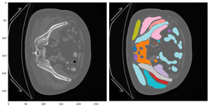

# FewCTSeg

## Context
CT-scans offer very precise 3D images of the human body (up to 0.5 mm resolution) and thus allow to capture the human anatomy.
The objective of this challenge is to automatically segment the anatomical structures of the human body, as well as tumors, on a CT-scan. In other words, it is about identifying the shapes visible on a CT-scan.
In the image below, from an abdominal CT scan, the different structures have been segmented:

.

## Goal

The goal of this challenge is to segment structures using their shape, but without exhaustive annotations.
The training data is composed of two types of images: partially annoted CT-scan images and raw CT-scan images

Partially annotated CT-scan images, with anatomical segmentation masks of individual structures, act as the field truth definition of what an anatomical structure is.
However, they are not supposed to be representative of all possible structures and their diversity, but can still be used as training material.
The masks do not contain all the organs annotated on the entire dataset. For example, on two abdominal images,
the mask for A will contain the liver and spleen, while the mask for B will only contain the spleen (while the liver is visible in the image).

Raw CT-scan images, without any segmented structure can be used as additional training material, in the context of unsupervised training.

The test set is composed of new images with all the corresponding segmented structures, and the metric measures the ability to correctly segment and separate the different structures on an image.

---

## UniMatch : a unique semi-supervised semantic segmentation technique

[UniMatch](https://arxiv.org/pdf/2208.09910) is a efficient novel deep learning framework that can be used to train semantic segmentation models in medical imaging when labels are limited and uses unlabeled images as extra training data under a consistency‑regularization framework. This method combines three consistency streams:

1. **Weak augmentation**  
   - Light perturbations(crop, rotation) → “soft” predictions.

2. **Feature‑perturbed stream**  
   - Dropout on encoder features → feature‑consistency loss.

3. **Strong augmentations**  
   - Two heavy views (CutMix) → image‑consistency loss  
   - Pseudo‑labels from the weak stream guide strong‑view predictions.

**Total loss** per batch:  
\[
\mathcal{L} = \mathcal{L}_{sup} \;+\;\lambda\,\mathcal{L}_{fp}\;+\;\mu\,\mathcal{L}_{img}
\]  
- `\(\mathcal{L}_{sup}\)`: supervised Dice on labeled data  
- \(\mathcal{L}_{fp}\): Dice between feature‑perturbed and weak‑stream outputs  
- \(\mathcal{L}_{img}\): average Dice between each strong‑view and weak pseudo‑labels  
- \(\lambda, \mu\): weighting hyperparameters

# 🔧 Our Adaptation

1. **Backbone & head**  
   - SegFormer encoder (`timm-efficientnet-b7`, pretrained)

2. **Data splits**  
   - 80 % labeled → training 
   - 20 % labeled → validation  
   - All empty‑mask images → unlabeled pool

3. **Strong augmentations**  
   - **CutMix** patch mixing + mask mixing  

4. **Pseudo‑label filtering**  
   - Pixel‑wise confidence ≥ τ → assign class, else 0 "background label"
   - Keep only masks with ≥ λ fraction of confident pixels

5. **Joint semi‑supervised training**  
   - Combine labeled + pseudo‑labeled sets  
   - Each batch:  
     - Weak pass → supervised + feature‑perturbation losses  
     - Strong pass → image‑consistency loss  
   - LR scheduling via `ReduceLROnPlateau`

# 📝 Loss Details

Let  
- \(x\): input image  
- \(\hat{y}_w\): weak‑stream logits  
- \(\hat{y}_{fp}\): feature‑perturbed logits  
- \(\hat{y}_{s1}, \hat{y}_{s2}\): strong‑stream logits  
- \(y\): ground‑truth (0…54)  
- \(\tilde{y} = \arg\max \text{softmax}(\hat{y}_w)\): pseudo‑label  

\[
\begin{aligned}
\mathcal{L}_{sup} &= \mathrm{Dice}(\hat{y}_w,\,y), \\
\mathcal{L}_{fp}  &= \mathrm{Dice}(\hat{y}_{fp},\,\tilde{y}), \\
\mathcal{L}_{img} &= \tfrac{1}{2}\bigl[\mathrm{Cross-Entropy}(\hat{y}_{s1},\,\tilde{y})
                         + \mathrm{Cross-Entropy}(\hat{y}_{s2},\,\tilde{y})\bigr], \\
\mathcal{L} &= \mathcal{L}_{sup} + \lambda\,\mathcal{L}_{fp} + \mu\,\mathcal{L}_{img}.
\end{aligned}
\]

