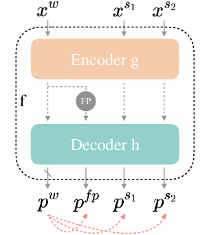

# FewCTSeg

## Context
CT-scans offer very precise 3D images of the human body (up to 0.5 mm resolution) and thus allow to capture the human anatomy.
The objective of this challenge is to automatically segment the anatomical structures of the human body, as well as tumors, on a CT-scan. In other words, it is about identifying the shapes visible on a CT-scan.
In the image below, from an abdominal CT scan, the different structures have been segmented:

.

## Goal

The goal of this challenge is to segment structures using their shape, but without exhaustive annotations.
The training data is composed of two types of images: partially annoted CT-scan images and raw CT-scan images

Partially annotated CT-scan images, with anatomical segmentation masks of individual structures, act as the field truth definition of what an anatomical structure is.
However, they are not supposed to be representative of all possible structures and their diversity, but can still be used as training material.
The masks do not contain all the organs annotated on the entire dataset. For example, on two abdominal images,
the mask for A will contain the liver and spleen, while the mask for B will only contain the spleen (while the liver is visible in the image).

Raw CT-scan images, without any segmented structure can be used as additional training material, in the context of unsupervised training.

The test set is composed of new images with all the corresponding segmented structures, and the metric measures the ability to correctly segment and separate the different structures on an image.

---

## UniMatch : a unique semi-supervised semantic segmentation technique

[UniMatch](https://arxiv.org/pdf/2208.09910) is a efficient novel deep learning framework that can be used to train semantic segmentation models in medical imaging when labels are limited and uses unlabeled images as extra training data under a consistency‑regularization framework (assumption that prediction of an unlabeled example should be invariant to different forms of perturbations). This method combines three consistency streams:

1. **Weak stream**  
   - Weak perturbations : geometric perturbation(crop, rotation) → generate pseudo-labels from the model trained on labeled data .

2. **Feature‑perturbed stream**  
   - Dropout on encoder features → feature‑consistency loss.

3. **Strong streams**  
   - Two strong perturbations from a non-determinstic augmentation(Cutout) → image‑consistency loss  
   - Pseudo‑labels from the weak stream guide strong‑view predictions.
  
These three streams should probalistically as close as possible to output a similar mask. Predictions are trained to match weak-stream pseudo-labels.

.

### 🔧 Our Adaptation

1. **Backbone & head**  
   - SegFormer architecture (pretrained)

2. **Data splits**  
   - 80 % labeled → training 
   - 20 % labeled → validation  
   - All empty‑mask images → unlabeled pool

3. **Strong augmentations**  
   - **Cutout**
    
4. **Pseudo‑label filtering of unlabeled images**  
   - Pixel‑wise confidence ≥ τ → assign class; others receive a sentinel IGNORE_INDEX value and are not used for unsupervised CE.
   - We optionally report `fraction_kept` per batch/epoch for monitoring.
  
5. **First phase : Supervised training**
   - Training with a $L_{sup} =Dice(y,ŷ)$ with $y$ ground‑truth mask and $ŷ$  predicted logits of a labeled image $x$
   - 
6. **Seconde phase : semi‑supervised training**  
   - Combine labeled + pseudo‑labeled sets in a mixed batch  
   - LR scheduling via `ReduceLROnPlateau`
   - Training with a $L =0.5 ( L_{sup} + L_{unsup})$

### 📝 Unsupervised Loss Details

Let  

$x_u$  an input unlabeled image, $ŷ_w$ weak‑stream logits, $ŷ_{fp}$ feature‑perturbed logits, $ŷ_{s1}$, $ŷ_{s2}$ strong‑stream logits and $ẏ$ pseudo‑label from weak stream (Pixel‑wise confidence ≥ τ → assign class).

The unsupervised loss is
$L_{unsup}  =  λ·L_{fp} + μ·L_s$

where

- $L_{fp}$:  Cross-entropy loss between feature-perturbed logits and weak pseudo‑labels ($L_{fp}  = CE(ŷ_{fp}, ẏ)$)

- $L_s$ : Average Cross-entropy between each strong‑view and weak pseudo‑labels ($L_{img} =0.5 [CE(ŷ_{s1}, ẏ) + CE(ŷ_{s2}, ẏ)]$)

- λ, μ: Weighting hyperparameters

