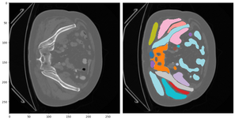
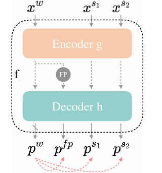

# FewCTSeg

## Context
CT-scans offer very precise 3D images of the human body (up to 0.5 mm resolution) and thus allow to capture the human anatomy.
The objective of this challenge is to automatically segment the anatomical structures of the human body, as well as tumors, on a CT-scan. In other words, it is about identifying the shapes visible on a CT-scan."z
In the image below, from an abdominal CT scan, the different structures have been segmented:

.

## Goal

The goal of this challenge is to segment structures using their shape, but without exhaustive annotations.
The training data is composed of two types of images: partially annoted CT-scan images and raw CT-scan images

Partially annotated CT-scan images, with anatomical segmentation masks of individual structures, act as the field truth definition of what an anatomical structure is.
However, they are not supposed to be representative of all possible structures and their diversity, but can still be used as training material.
The masks do not contain all the organs annotated on the entire dataset. For example, on two abdominal images,
the mask for A will contain the liver and spleen, while the mask for B will only contain the spleen (while the liver is visible in the image).

Raw CT-scan images, without any segmented structure can be used as additional training material, in the context of unsupervised training.

The test set is composed of new images with all the corresponding segmented structures, and the metric measures the ability to correctly segment and separate the different structures on an image.

---

## UniMatch : a unique semi-supervised semantic segmentation technique

[UniMatch](https://arxiv.org/pdf/2208.09910) is a efficient novel deep learning framework that can be used to train semantic segmentation models when labels are limited and uses unlabeled images as extra training data under a consistency‑regularization framework (assumption that prediction of an unlabeled example should be invariant to different forms of perturbations). This method combines three consistency streams:

1. **Weak stream**  
   - The weak stream applies weak perturbations, such as geometric transformations like crop and rotation. The goal of this stream is to generate pseudo-labels from a model trained on labeled data.

2. **Feature‑perturbed stream**  
   - The feature-perturbed stream introduces dropout on the encoder features, which leads to a feature-consistency loss.

3. **Strong streams**  
   - The strong streams apply two strong perturbations derived from non-deterministic augmentations. This results in an image-consistency loss.
  
These three streams should be probalistically as close as possible to output a similar mask. Predictions from the feature-perturbed stream and the strong streams are trained to match the pseudo-labels from the weak stream. 
.

### 🔧 Our Adaptation

1. **Backbone & head**  
   - We use a SegFormer architecture (pretrained on ImageNet)

2. **Data splits**  
   - All images with empty masks are assigned to the unlabeled pool, while images with non-empty masks go to the labeled pool.
   - 80% of the labeled images are used for training, while the remaining 20% are used for validation. 

3. **First phase : Supervised training**
   - Training with a $L_{sup} =Dice(y,ŷ)$ with $y$ ground‑truth mask and $ŷ$  predicted logits for a labeled image $x$

4. **Pseudo‑label filtering of unlabeled images**  
   - For each unlabeled image, pixel-wise confidence is calculated. If the confidence is greater than or equal to a threshold τ, we assign a class to that pixel. Otherwise, the pixel receives a sentinel IGNORE_INDEX value and is not considered in the unsupervised cross-entropy loss.
   - Optionally, we report the fraction_kept per batch or epoch to monitor the filtering process.

5. **Augmentations**  
   - For augmentations, we apply Cutout as a strong perturbation, Dropout as a feature perturbation, and Crop as a weak perturbation, as these combinations yielded the best results during testing.
    
6. **Seconde phase : semi‑supervised training**  
   - In the second phase, we combine the labeled and pseudo-labeled sets into a mixed batch. 
   - A lower learning rate of $1e^{-4}$ is used, with scheduling managed by `ReduceLROnPlateau`. 
   - Training with the following loss : $L =0.5 ( L_{sup} + L_{unsup})$.

### 📝 Unsupervised Loss Details

Let  

$x_u$ be an input unlabeled image, $ŷ_w$ the weak‑stream logits, $ŷ_{fp}$ the feature‑stream logits, $ŷ_{s1}$, $ŷ_{s2}$ the strong‑stream logits and $ẏ$ the weak pseudo-labels (generated from $ŷ_w$ by assigning a class when the pixel-wise confidence is greater than or equal to τ, Low-confidence pixels are set to `ignore_index`).

The unsupervised loss is
$L_{unsup}  =  λ·L_{fp} + μ·L_s$

where

- $L_{fp}$:  Cross-entropy loss between feature-stream logits and weak pseudo‑labels : $L_{fp}  = CE(ŷ_{fp}, ẏ)$

- $L_s$ : Average Cross-entropy between each strong‑stream logits and weak pseudo‑labels : $L_{s} =0.5 [CE(ŷ_{s1}, ẏ) + CE(ŷ_{s2}, ẏ)]$

- λ, μ: Weighting hyperparameters

